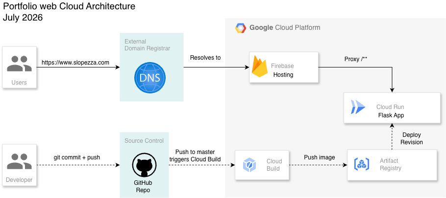

# Portfolio Website

This repository contains the source code for my personal portfolio website. The site is designed as a lightweight Flask application to present my background, technical projects, and data science work in a single, navigable experience.

## What this project does

The portfolio is structured as a route-based web application with dedicated pages for:
- the main landing page
- an About Me section
- a portfolio overview with individual project pages
- a speaker engagement and community outreach page

Each page is rendered with Flask and Jinja templates, while project assets such as images, PDFs, and styling are served from the application’s static directory.

## Technical overview

- Backend: Python with Flask
- Templating: Jinja2 and Flask-Bootstrap
- Application entrypoint: application.py
- Route definitions: app/routes.py
- Configuration: config.py
- Static assets: app/static/ (CSS, documents, images, HTML playground demos)
- Production serving: Gunicorn
- Deployment: Firebase Hosting with Cloud Run rewrites



## Project structure

- app/__init__.py: initializes the Flask app and registers extensions
- app/routes.py: defines the site routes and page rendering logic
- app/templates/: HTML templates for each section of the portfolio
- app/static/: CSS, images, downloadable documents, and interactive playground files
- requirements.txt: Python dependencies
- Dockerfile: container definition for deployment
- firebase.json: hosting configuration for the front door and backend routing

## Local development

1. Create and activate a virtual environment
2. Install dependencies:
   ```bash
   pip install -r requirements.txt
   ```
3. Run the app locally:
   ```bash
   flask --app application.py run
   ```

## Deployment notes

The site is intended to run behind a production WSGI server such as Gunicorn, and the repository also includes container support through Docker. The Firebase configuration points requests to a Cloud Run service, making the app suitable for modern serverless-style hosting.
